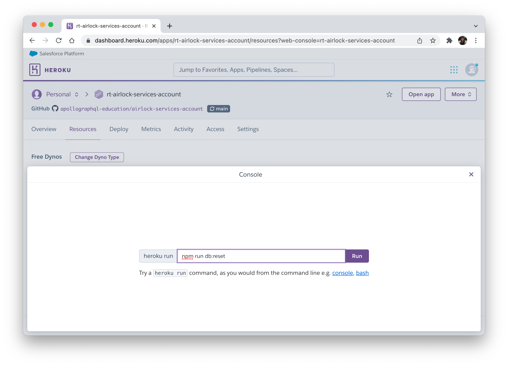

# Airlock Subgraph - Reviews

This subgraph is responsible for all things reviews-related.

[Hosted on Heroku](https://dashboard.heroku.com/apps/rt-airlock-subgraphs-reviews).

Connected to a federated graph on Studio.

## Running the `reviews` subgraph locally

1. Run `npm install`.

1. If you don't want to run the Listings REST APIs locally, create a `.env` file and copy the contents from `.env-example`.

1. Run `npm start-dev`.

## Database setup for local / learners (sqlite)

There is a `reviews.db` and `bookings.db` files in the `datasources` folder already seeded with data.

You can reset it back to the defaults by running `npm run db:reset`.

You can view the contents of the database by downloading **[DB Browser for SQLite](https://sqlitebrowser.org/dl/)**.

## Database setup for production (Postgres)

## Setting up the database

We're using Postgres and Sequelize.

We recommend installing a PostgreSQL Client to make it easier to query and see your data. We use [Postico](https://eggerapps.at/postico/) for Mac.

First, let's set up Postgres.

1. [Install Postgres](https://www.postgresql.org/download/macosx/). I used the Interactive Installer by EDB, version 14.2.

1. Go through the setup wizard. This will prompt you to set up a user and password. I went with `postgres` and `password` respectively.

## Local database development

This section covers how to add initial data to this service (for Dev Ed team, not for learners). This is for LOCAL database development.

### Creating the local db

1. From the PostgreSQL 14 folder that gets installed in the previous section, open up the `psql` SQL Shell app. This will prompt you to sign in with the credentials you had previously set up.

1. Let's create the reviews database. Run:

   ```shell
   create database reviews_db_dev;
   ```

### Connect to the local Postgres database

1. Open up [Postico](https://eggerapps.at/postico/) or whatever PostgreSQL client you're using.

1. Connect to the local database using the following values:

   ```
   host: localhost
   port: 5432
   user: postgres (or whatever credentials you had previously set up)
   password: password  (or whatever credentials you had previously set up)
   database: accounts_db_dev
   ```

   You should see something like this when you click on the `Bookings` table.

   

### Making changes

We could use migrations from `sequelize` properly here but let's keep it simple and only have 1 migration file to deal with. We can discuss any conflicts we run into within the team.

**Adding a new column to the table**

1. Undo all migrations to start database from scratch.

```shell
npx sequelize-cli db:migrate:undo:all
```

1. Update the file in `models` folder with the new properties you want to add.

1. Update the file in `migrations` folder to match those new properties.

**Adding more data to seed initial state of table**

1. Add data to the JSON file in the `seeders` folder.

**Re-running with new migrations and new data**

1. Run the following command:

```shell
npm run db:reset
```

## Publishing changes to the production database

We're hosting this subgraph in Heroku, which takes care of the database hosting for us.

If you go to the Heroku app's Resources tab. Under the Add-on's section, you'll see the Heroku database if you want to take a look at the details for that production database.

We want to run the db:reset command in the production database. To do this:

1. Push your changes to the GitHub `main` branch. This will trigger an automatic deploy to Heroku.

1. Go to the Heroku app. Click on **More** on the top right, then **Run console**.

1. In the console, type `npm run db:reset`. This will trigger the script and reset the database.



All done!

## Accessing the production database

You can use Postico to access the production database in the same way you can for the local database.

1. Go to the Heroku app dashboard.

1. Go to the Heroku app's Resources tab. Under the Add-on's section, you'll see the Heroku database, click on it.

1. Click on the Settings tab, then View Credentials.

1. Copy the value of the URI property (this value changes every so often, so you may need to repeat these steps if you lose connection).

1. Paste it into your browser bar, which will prompt you to open it through Postico. Click Open Postico.app.

1. Click Connect at the prompt about the identity of the server. You'll then see the database and the data inside it. This is production data so be careful with what you do!
